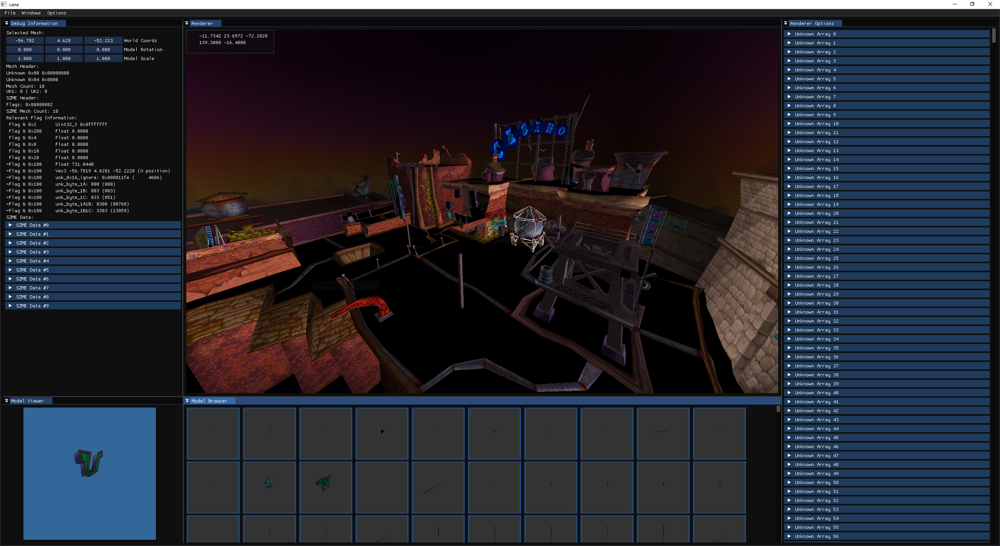

# cane



## Project Description

This project is a work in progress level editor for the Sly Cooper games.

Cane supports building on Windows and Linux.

Prerequisites:
 * cmake
 * git  
   
 
 ## Getting Started - Windows

Install Packages and Init Repository  

Install Git for Windows from [here](https://git-scm.com/download/win) (git-scm.com)  
Install CMake for Windows from [here](https://cmake.org/download/) (cmake.org)  

1. Open Powershell or cmd in the directory you want your cane folder to be.
2. Run the following commands:  
```
git clone --recurse-submodules https://github.com/detolly/cane.git
cd cane
```

Compile
```bash
mkdir build && cd build && cmake .. && cmake --build --config Release .
```

Run

Run cane.exe

## Getting Started - Linux (Ubuntu/Debian)

Install Packages and Init Repository
```bash
sudo apt-get install cmake git build-essential
git clone --recurse-submodules https://github.com/detolly/cane.git
cd cane
```

Compile
```bash
mkdir build && cd build && cmake .. && cmake --build --config Release
```

Run
```bash
./cane
```

## Getting Started - Linux (Arch)
Install Packages and Init Repository
```bash
pacman -S cmake git base-devel
git clone --recurse-submodules https://github.com/detolly/cane.git
cd cane
```

Compile
```bash
mkdir build && cd build && cmake .. && cmake --build . --config Release
```

Run
```bash
./cane
```
